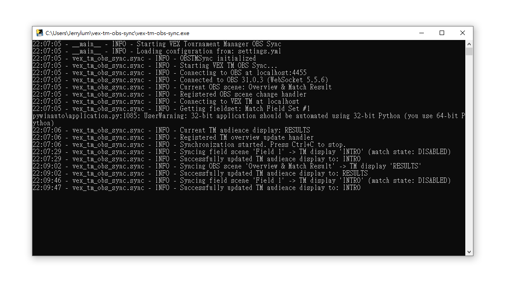

# VEX Tournament Manager OBS Sync

A Python application that synchronizes OBS scenes with VEX Tournament Manager audience display modes. This tool enables seamless integration between your streaming setup and tournament management, automatically switching between displays as scenes change.

> [!CAUTION]
> **This software is very likely to be considered as unauthorized software.** This software accesses Tournament Manager through UI automation instead of the official TM Public API (Local TM API). While this software respect the spirit of the TM Public API guidelines, as an Event Partner, please be aware that using this software might be considered as a violation of the Commitment to Event Excellence.
>
> **Read the official [TM Public API guidelines](https://kb.roboticseducation.org/hc/en-us/articles/19238156122135) and [Commitment to Event Excellence](https://kb.roboticseducation.org/hc/en-us/articles/12094736701975-Commitment-to-Event-Excellence) before using this software in any official event.**

## Features

- **Bidirectional Sync**: Synchronize OBS scene changes to VEX TM audience display and vice versa
- **Configurable Mappings**: Define custom mappings between OBS scenes and TM display modes via YAML
- **Multiple Usage Modes**: Run from source, as standalone executable, or via command line
- **Real-time Updates**: Instant synchronization with minimal latency
- **Robust Error Handling**: Graceful handling of connection issues and configuration errors
- **Free Software**: This software is a free software, you have the freedom to build your own version without the need to ask for an API key or any other permission.



## Requirements

- Python 3.11 or higher (for development)
- Windows OS (required for VEX Tournament Manager Bridge)
- OBS Studio with WebSocket server enabled
- VEX Tournament Manager running and accessible
- Network access between all components

## Installation & Usage

### Method 1: Development (Recommended)

1. **Clone the repository:**

   ```bash
   git clone https://github.com/yourusername/vex-tm-obs-sync.git
   cd vex-tm-obs-sync
   ```

2. **Install uv package manager:**

   ```powershell
   powershell -c "(irm https://astral.sh/uv/install.ps1) | iex"
   ```

3. **Install dependencies:**

   ```bash
   uv sync
   ```

4. **Configure the application:**

   - Copy and edit `settings.yml` to match your setup
   - Configure OBS WebSocket settings and VEX TM connection

5. **Run the application:**
   ```bash
   uv run vex-tm-obs-sync
   # or
   uv run python -m vex_tm_obs_sync
   ```

### Method 2: Standalone Executable

1. **Download the latest release** from the releases page
2. **Create a `settings.yml` file** in the same directory as the executable
3. **Double-click** `vex-tm-obs-sync.exe` to run

### Method 3: Command Line with Custom Config

```bash
# With development setup
uv run vex-tm-obs-sync --config /path/to/custom-settings.yml

# With standalone executable
vex-tm-obs-sync.exe --config /path/to/custom-settings.yml
```

## Configuration

Create a `settings.yml` file with the following structure:

```yaml
# OBS WebSocket connection settings
obs:
  host: "localhost" # OBS WebSocket host
  port: 4455 # OBS WebSocket port
  password: null # OBS WebSocket password (if set)

# VEX Tournament Manager settings
vex_tm:
  host: "localhost" # VEX TM host IP address
  competition: "V5RC" # Competition type: V5RC or VIQRC
  fieldset_title: "Match Field Set #1" # Name of the fieldset to control

# Field scene mappings for field-specific camera views
# These scenes correspond to specific fields and automatically switch
# between "Intro" and "In-Match" displays based on match state
field_scene_mappings:
  - obs_scene: "Field 0"
  - obs_scene: "Field 1"
  - obs_scene: "Field 2"

# Other scene mappings between OBS and VEX TM audience display
# Direct one-to-one mappings for non-field scenes
other_scene_mappings:
  - obs_scene: "Logo"
    tm_display: "LOGO"
  - obs_scene: "Overview & Match Result"
    tm_display: "RESULTS"
  - obs_scene: "Rankings"
    tm_display: "RANKINGS"
  - obs_scene: "Skills Rankings"
    tm_display: "SC_RANKINGS"

# Sync direction settings
sync_tm_to_obs: true # Sync TM changes to OBS
sync_obs_to_tm: true # Sync OBS changes to TM
```

### Field-Based Scene Management

The application supports two types of scene mappings:

**Field Scenes**: Automatically switch between displays based on match state and field

- When switching to a field scene in OBS, TM display changes to "INTRO" (if no match) or "IN_MATCH" (if match running)
- When TM switches to "INTRO" or "IN_MATCH", OBS switches to the current field's scene (based on TM's current field ID)
- Field scenes are indexed starting from 0 (Field 0 = TM Field ID 0, Field 1 = TM Field ID 1, etc.)

**Other Scenes**: Direct one-to-one mappings

- Each scene maps directly to a specific TM audience display mode
- Bidirectional sync: changing OBS scene updates TM display, and vice versa

### Valid VEX TM Audience Display Modes

- `BLANK` - Blank screen
- `LOGO` - Event logo display
- `INTRO` - Pre-match introduction
- `IN_MATCH` - During match play
- `RESULTS` - Post-match results
- `SCHEDULE` - Match schedule
- `RANKINGS` - Team rankings display
- `SC_RANKINGS` - Skills rankings display
- `ALLIANCE_SELECTION` - Alliance selection (V5RC only)
- `BRACKET` - Elimination bracket (V5RC only)
- `AWARD` - Award slides
- `INSPECTION` - Robot inspection

## Setup Instructions

### OBS Studio Setup

1. **Enable WebSocket Server:**

   - Go to `Tools` → `WebSocket Server Settings`
   - Check "Enable WebSocket server"
   - Set port to `4455` (default)
   - Set password if desired (update config accordingly)

2. **Create Scenes:**
   - Create scenes that match your `settings.yml` configuration
   - Scene names are case-sensitive

### VEX Tournament Manager Setup

1. **Open Tournament Manager** on the specified host
2. **Open Match Field Set:** Go to `Match` → `Match Field Set` and open your fieldset dialog at least once
3. **Network Access:** Ensure the VEX TM host is accessible from the sync application

## Command Line Options

```bash
vex-tm-obs-sync [OPTIONS]

Options:
  -c, --config PATH    Path to configuration file (default: settings.yml)
  --debug             Enable debug logging
  --version           Show version information
  --help              Show help message
```

## Building the Executable

### Local Build

```bash
# Install development dependencies
uv sync --dev

# Build the executable
uv run pyinstaller --onefile --name vex-tm-obs-sync src/vex_tm_obs_sync/main.py
```

The executable will be created in the `dist/` directory.

### GitHub Actions Build

The project includes GitHub Actions workflows for automated building:

- **Development builds** on every push to main
- **Release builds** when creating a new tag

## Troubleshooting

### Common Issues

1. **"Settings file not found"**

   - Ensure `settings.yml` exists in the same directory as the executable
   - Or specify a custom path with `--config`

2. **"Failed to connect to OBS"**

   - Verify OBS WebSocket server is enabled
   - Check host/port/password settings
   - Ensure OBS is running

3. **"Failed to connect to VEX TM"**

   - Verify VEX Tournament Manager is running
   - Check host IP address setting
   - Ensure Match Field Set dialog has been opened at least once

4. **"No mapping found for scene/display"**
   - Check scene names match exactly (case-sensitive)
   - Verify mappings in `settings.yml`
